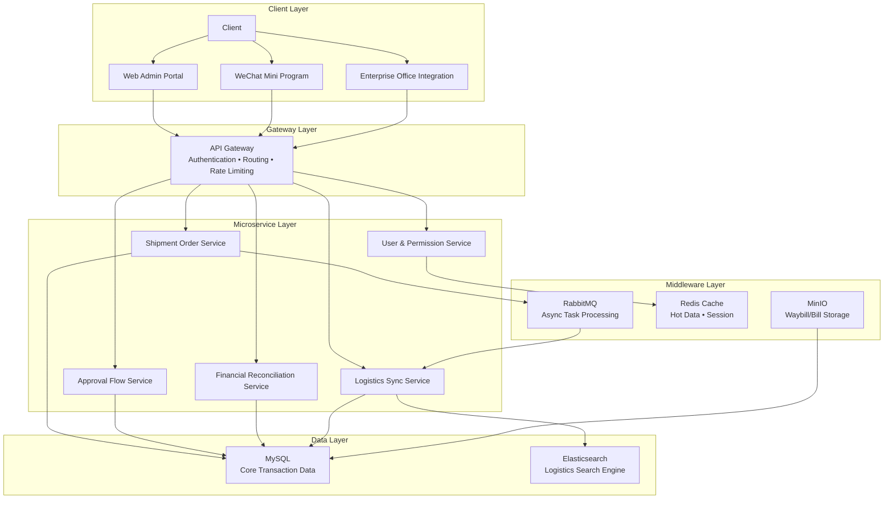
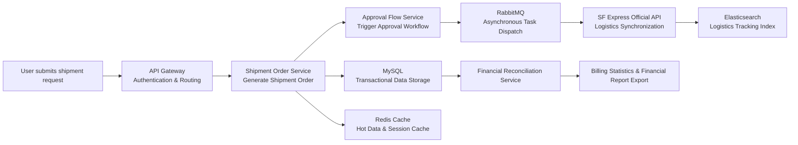

### 
<div style="display:flex; align-items:center; gap:12px; margin-bottom:20px;">


<strong>
Enterprise Logistics Management Platform Design
</strong>

<span style="color:gray;">
3M+ DAU · 40M+ Daily Requests
</span>

</div>


# System Overview

SF Express Courier Manager System is an enterprise-grade logistics management platform designed to support large-scale corporate shipment operations across domestic and international delivery workflows.

The platform integrates:

- Shipment order management
- Multi-stage approval workflows
- Real-time logistics synchronization
- Financial reconciliation and billing
- Enterprise permission management

The system was designed using a distributed microservices architecture to improve scalability, operational reliability, and maintainability under high-concurrency business scenarios.

By centralizing previously fragmented logistics processes, the platform significantly improved operational efficiency, shipment visibility, and financial standardization across organizational departments.

# Problem Statement & Constraints

## Problem Statement

Many organizational shipment workflows relied heavily on:

- Manual order submission
- Offline approval processes
- Fragmented logistics tracking
- Manual financial reconciliation

These issues resulted in:

- Low operational efficiency
- Inconsistent process management
- Ambiguous cost allocation
- Poor shipment visibility
- Weak logistics standardization

The project aimed to build a centralized logistics management platform capable of standardizing shipment operations while improving scalability, reliability, and financial traceability.

---

## Business Constraints

1. Support multi-level organizational role permissions and department-level data isolation.

2. Strictly comply with SF Express shipping policies, billing standards, and API specifications.

3. Provide customizable approval workflows to support different organizational management processes.

4. Support automated expense allocation, standardized billing, and compliant financial statement export.

---

## Technical Constraints

1. Maintain system stability under high-concurrency shipment submission scenarios.

2. Achieve low-latency synchronization with external SF Express APIs.

3. Optimize storage and query performance for large-scale order and logistics datasets.

4. Protect sensitive shipment information, including addresses and contact details.

5. Support integration with:
   - Web platforms
   - WeChat mini-programs
   - Third-party enterprise office systems

---

# System Architecture & High-Level Design

## Architecture Diagram



---

## Core Data Flow

---

## Design Rationale

### Microservices Architecture

The platform adopts a microservices architecture to separate major business domains, including order processing, approval workflows, logistics synchronization, and financial reconciliation.

This design improves:

- Independent deployment capability
- Horizontal scalability
- Fault isolation
- Long-term maintainability

For example, failures in logistics synchronization services do not directly affect order creation or approval processing.

---

### MySQL for Transactional Consistency

The platform contains multiple transaction-sensitive workflows, including:

- Shipment creation
- Approval state transitions
- Expense allocation
- Financial reconciliation

MySQL was selected because it provides:

- ACID transaction guarantees
- Strong relational modeling capability
- Reliable multi-table query performance
- Financial-grade data consistency

This architecture ensures reliable operational and financial traceability across shipment workflows.

---

### RabbitMQ for Asynchronous Processing

Several operations within the system are resource-intensive and latency-sensitive, including:

- Real-time logistics synchronization
- Batch waybill generation
- Financial statistics aggregation

RabbitMQ decouples upstream business services from downstream external API interactions, improving system throughput and reducing synchronous blocking risks under high-concurrency workloads.

This design also improves eventual consistency and operational resilience when interacting with third-party services.

---

### Redis Cache Layer

Redis is used to cache frequently accessed data, including:

- User session information
- Permission metadata
- Common shipment addresses
- Frequently queried pricing templates

The cache layer significantly reduces repeated database access and improves response performance during peak traffic periods.

---

### Elasticsearch for Logistics Tracking

Logistics trajectory records contain large volumes of semi-structured tracking data that require fast full-text retrieval.

Elasticsearch provides:

- High-performance search capability
- Fast order and tracking number queries
- Efficient trajectory retrieval
- Better scalability for real-time logistics search workloads

Compared with relational database querying, Elasticsearch provides significantly better performance for large-scale tracking retrieval scenarios.

# Core Code Demonstration

This section highlights simplified core implementations that reflect key architectural decisions in the system, including asynchronous processing, service layering, and transactional consistency.

---

## Order Creation Service (Core Business Logic)

This service handles shipment order creation and ensures transactional integrity.

```java
@Service
public class ShipmentOrderService {

    @Autowired
    private OrderRepository orderRepository;

    @Autowired
    private RabbitTemplate rabbitTemplate;

    @Transactional
    public Long createOrder(CreateOrderRequest request) {

        // 1. Validate input & business rules
        validateRequest(request);

        // 2. Persist order (MySQL transaction)
        Order order = new Order();
        order.setUserId(request.getUserId());
        order.setStatus("PENDING_APPROVAL");
        orderRepository.save(order);

        // 3. Publish async event to MQ (logistics sync, billing, etc.)
        rabbitTemplate.convertAndSend(
            "order.exchange",
            "order.created",
            order.getId()
        );

        return order.getId();
    }
}
```

### Key Design Points

- Uses **@Transactional** to ensure database consistency
- Decouples downstream processing via **RabbitMQ**
- Follows **event-driven architecture pattern**
- Keeps API response fast by avoiding synchronous external calls

---

## Asynchronous Logistics Synchronization Consumer

This component processes order events asynchronously and integrates with external SF Express APIs.

```java
@Component
public class LogisticsSyncConsumer {

    @RabbitListener(queues = "order.created.queue")
    public void handleOrderCreated(Long orderId) {

        // 1. Fetch order data
        Order order = orderService.findById(orderId);

        // 2. Call external SF Express API
        TrackingInfo trackingInfo = sfExpressClient.createShipment(order);

        // 3. Store tracking result
        logisticsRepository.save(trackingInfo);

        // 4. Index into Elasticsearch for fast search
        elasticsearchService.indexTracking(trackingInfo);
    }
}
```

### Key Design Points

- Implements **asynchronous event-driven processing**
- Avoids blocking main order creation flow
- Integrates external API safely with retryable consumer model
- Separates OLTP (MySQL) and search (Elasticsearch) concerns

---

## Cache Strategy (Redis Usage Example)

Used for reducing database load on frequently accessed user data.

```java
@Service
public class UserService {

    @Autowired
    private RedisTemplate<String, Object> redisTemplate;

    @Autowired
    private UserRepository userRepository;

    public User getUser(Long userId) {

        String key = "user:" + userId;

        // 1. Try cache first
        User cachedUser = (User) redisTemplate.opsForValue().get(key);
        if (cachedUser != null) {
            return cachedUser;
        }

        // 2. Fallback to DB
        User user = userRepository.findById(userId).orElse(null);

        // 3. Store in cache
        if (user != null) {
            redisTemplate.opsForValue().set(key, user, Duration.ofMinutes(30));
        }

        return user;
    }
}
```

### Key Design Points

- Implements **cache-aside pattern**
- Reduces MySQL read pressure
- Improves response time for frequent queries
- Adds TTL for cache freshness control

---

## Design Summary

The core implementation demonstrates:

- Event-driven architecture using RabbitMQ
- Strong transactional consistency with MySQL
- High-performance read optimization via Redis
- Separation of concerns between:
  - Transaction storage (MySQL)
  - Search index (Elasticsearch)
  - Async processing (RabbitMQ)

This design reflects production-level backend engineering practices commonly used in distributed enterprise systems.