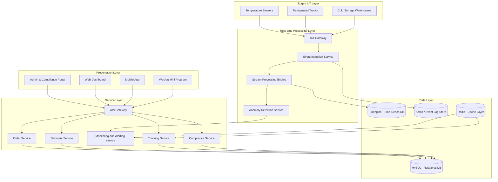
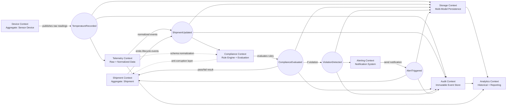
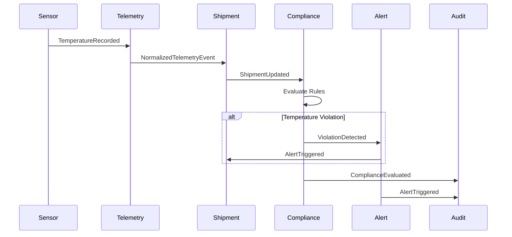

###
<div style="display:flex; align-items:center; gap:12px; margin-bottom:20px;">


<strong>
Event-Driven Distributed Architecture for Real-Time Temperature Compliance
</strong>

<span style="color:gray;">
</span>

</div>

## 1. System Overview

This project designs a **cold chain logistics platform** that enables real-time monitoring, tracking, and compliance management for temperature-sensitive shipments such as food and pharmaceuticals.

The system ensures that every shipment maintains a valid temperature range across warehouses, trucks, and last-mile delivery, while providing audit-grade traceability and real-time alerts.

---

## 2. Requirements, Scale & Constraints

### Functional Requirements

* Real-time shipment tracking
* Continuous temperature monitoring via IoT sensors
* Alert generation on temperature violation
* Shipment lifecycle management (created → in transit → delivered)
* Compliance reporting for audits

### Non-Functional Requirements

* Low latency alerting (< 5 seconds for anomaly detection)
* High availability (> 99.9%)
* Strong data integrity (immutable logs)
* Scalable to millions of sensor events per day

### Key Constraints

* Intermittent connectivity in transit (offline trucks)
* Heterogeneous IoT devices and protocols
* Strict regulatory compliance (food/pharma audit requirements)
* High cost of failure (product spoilage)

---

## 3. Problem Definition & Risk Model

Cold chain logistics is fundamentally a **risk-sensitive distributed system** where failure is irreversible.

### Key Risks

* Temperature deviation leading to spoilage
* Sensor failure or data loss
* Delayed detection of anomalies
* Inconsistent state across distributed actors

### Risk Impact Model

Temperature problems are grouped by how serious they are and how long they last:

- **Minor deviation**: Small or short temperature changes that slightly affect product quality, but are still within safe limits.

- **Major deviation**: Longer or more serious temperature issues that damage the product, causing it to be rejected.

- **Critical system failure**: System breakdowns (such as sensor loss or cooling failure) that make the shipment invalid and lead to financial loss and possible compliance issues.

---

## 4. System Architecture

### Architecture Diagram



### Key Services

| Component                     | Description                                              |
|------------------------------|----------------------------------------------------------|
| IoT Gateway Layer            | Normalizes sensor protocols                              |
| Event Ingestion Service      | Receives and validates incoming telemetry               |
| Stream Processing Engine     | Processes events in real time                           |
| Anomaly Detection Service    | Detects temperature violations                          |
| Storage Layer                | Combines time-series, relational, and event log storage |

---

## 5. Data Architecture & Event Model

### Domain-Driven Event-Oriented Architecture



### Key Information Flow Table 

| Stage | Information Flow | Participating Domains | Core System Responsibility | Complexity Handled |
|------|------------------|----------------------|----------------------------|-------------------|
| 1 | Real-time sensor telemetry ingestion | IoT Devices, Gateway Layer | Collect and normalize heterogeneous device protocols | High-frequency distributed telemetry streams |
| 2 | Event validation and enrichment | Event Ingestion Service, Shipment Context | Validate incoming data and associate telemetry with shipment entities | Incomplete, delayed, or duplicated event handling |
| 3 | Real-time stream processing | Stream Processing Engine | Continuously process large-scale temperature and logistics events | Stateful event aggregation and temporal correlation |
| 4 | Compliance rule evaluation | Compliance Context | Evaluate temperature thresholds, transport duration, and regulatory constraints | Dynamic rule execution across distributed shipment states |
| 5 | Anomaly and violation detection | Anomaly Detection Service, Alerting Context | Detect temperature excursions and operational abnormalities | Real-time exception detection under continuous event flow |
| 6 | Cross-domain event propagation | Shipment, Compliance, Alerting Contexts | Coordinate loosely coupled business domains through asynchronous events | Distributed consistency and event-driven orchestration |
| 7 | Multi-model data persistence | Time-Series DB, Relational DB, Event Store | Persist telemetry, shipment metadata, and immutable audit records | Heterogeneous storage optimization and traceability |
| 8 | Historical analytics and traceability | Analytics & Audit Contexts | Support operational reporting, compliance auditing, and event replay | Long-term analytical querying across large-scale event histories |

### Sequence & Lifecycle Flow Diagram


---

## 6. Real-time Processing & IoT Pipeline

### Streaming Flow

1. Sensors emit temperature readings
2. Edge gateway buffers offline data
3. Ingestion service validates & forwards events
4. Stream processor evaluates thresholds
5. Anomaly detection triggers alerts

### Key Design Choice

* Use **event-driven architecture** instead of polling
* Ensures low latency and decoupled services

---

## 7. Failure Handling & Edge Cases

### Offline Truck Scenario

* Edge gateway buffers events locally
* Syncs when connectivity returns

### Sensor Failure

* Redundant sensors per container
* Fallback estimation model using historical data

### Delayed Data Arrival

* Event timestamp vs ingestion timestamp separation
* Late-arrival correction logic in stream processor

### System Overload

* Kafka-like buffering layer
* Backpressure handling in ingestion pipeline

---

## 8. Key Engineering Decisions & Tradeoffs

### 1. Event-Driven vs REST Polling

* Chosen: Event-driven
* Reason: lower latency, scalable ingestion

### 2. Time-Series DB vs Relational DB

* Time-series DB for sensor data due to high write volume
* Relational DB for transactional consistency

### 3. Immutable Event Logs

* Ensures auditability
* Supports compliance requirements

### Tradeoff

* Higher storage cost vs strong traceability guarantees

---

## 9. Core Code Demonstration

### Cold Chain Temperature Anomaly Detection — Multi-Strategy Design

#### Overview

This module implements a strategy-based temperature anomaly detection design for a cold chain logistics system. It supports multiple shipment types with different regulatory temperature constraints using the Strategy Pattern for extensible rule evaluation.

#### 1. Strategy Interface

```java
public interface AnomalyDetectionStrategy {
    AnomalyResult evaluate(TemperatureReading reading);
}
```
#### 2. Strategy Interface
```java
import java.time.Duration;
import java.time.LocalDateTime;

public abstract class AbstractColdChainStrategy
        implements AnomalyDetectionStrategy {

    protected boolean isOutOfRange(double temp, double min, double max) {
        return temp < min || temp > max;
    }

    protected boolean isExcursionTooLong(
            LocalDateTime start,
            Duration limit
    ) {
        return Duration.between(start, LocalDateTime.now())
                .compareTo(limit) > 0;
    }

    protected String severity(double temp) {
        if (temp > 15 || temp < -10) return "CRITICAL";
        return "WARNING";
    }
}
```
#### 3. Frozen Goods Strategy (Highly Strict)
```java
import java.time.Duration;

public class FrozenGoodsStrategy extends AbstractColdChainStrategy {

    private static final double MIN = -25.0;
    private static final double MAX = -18.0;
    private static final Duration LIMIT = Duration.ofMinutes(5);

    @Override
    public AnomalyResult evaluate(TemperatureReading r) {

        boolean violation =
                isOutOfRange(r.temperature(), MIN, MAX) &&
                isExcursionTooLong(r.timestamp(), LIMIT);

        if (violation) {
            return AnomalyResult.violation(
                    severity(r.temperature()),
                    "Frozen goods temperature breach"
            );
        }

        return AnomalyResult.normal();
    }
}
```
#### 4. Vaccine Transport Strategy
```java
import java.time.Duration;

public class VaccineStrategy extends AbstractColdChainStrategy {

    private static final double MIN = 2.0;
    private static final double MAX = 8.0;
    private static final Duration LIMIT = Duration.ofMinutes(15);

    @Override
    public AnomalyResult evaluate(TemperatureReading r) {

        boolean violation =
                isOutOfRange(r.temperature(), MIN, MAX) &&
                isExcursionTooLong(r.timestamp(), LIMIT);

        if (violation) {
            return AnomalyResult.violation(
                    severity(r.temperature()),
                    "Vaccine cold chain violation detected"
            );
        }

        return AnomalyResult.normal();
    }
}
```
#### 5. Fresh Produce Strategy
```java
import java.time.Duration;

public class FreshProduceStrategy extends AbstractColdChainStrategy {

    private static final double MIN = 0.0;
    private static final double MAX = 12.0;
    private static final Duration LIMIT = Duration.ofHours(1);

    @Override
    public AnomalyResult evaluate(TemperatureReading r) {

        boolean violation =
                isOutOfRange(r.temperature(), MIN, MAX) &&
                isExcursionTooLong(r.timestamp(), LIMIT);

        if (violation) {
            return AnomalyResult.violation(
                    severity(r.temperature()),
                    "Fresh produce quality risk detected"
            );
        }

        return AnomalyResult.normal();
    }
}
```
#### 6. Pharmaceutical Lab Samples Strategy
```java
import java.time.Duration;

public class PharmaLabStrategy extends AbstractColdChainStrategy {

    private static final double MIN = 2.0;
    private static final double MAX = 6.0;
    private static final Duration LIMIT = Duration.ofMinutes(10);

    @Override
    public AnomalyResult evaluate(TemperatureReading r) {

        boolean violation =
                isOutOfRange(r.temperature(), MIN, MAX) ||
                isExcursionTooLong(r.timestamp(), LIMIT);

        if (violation) {
            return AnomalyResult.violation(
                    "CRITICAL",
                    "Pharmaceutical sample integrity compromised"
            );
        }

        return AnomalyResult.normal();
    }
}
```


### Design Intent
- Achieve low coupling between rule evaluation and system orchestration  
- Maintain high cohesion within each domain-specific compliance strategy  
- Improve system maintainability through modular and extensible design  

