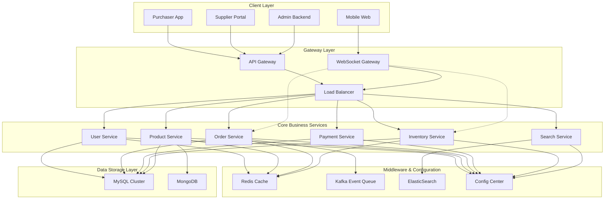
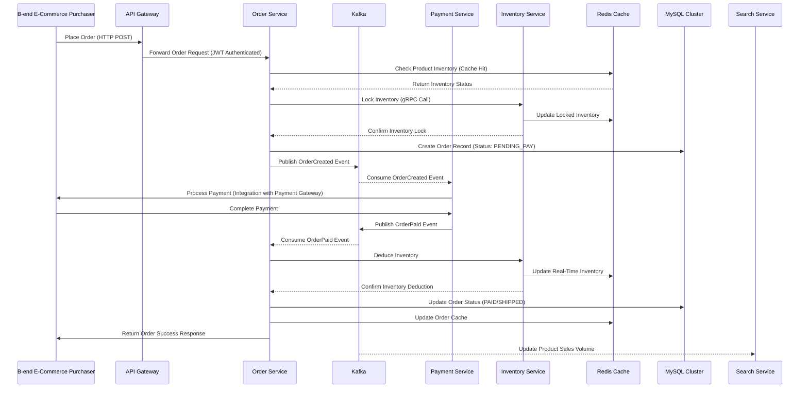
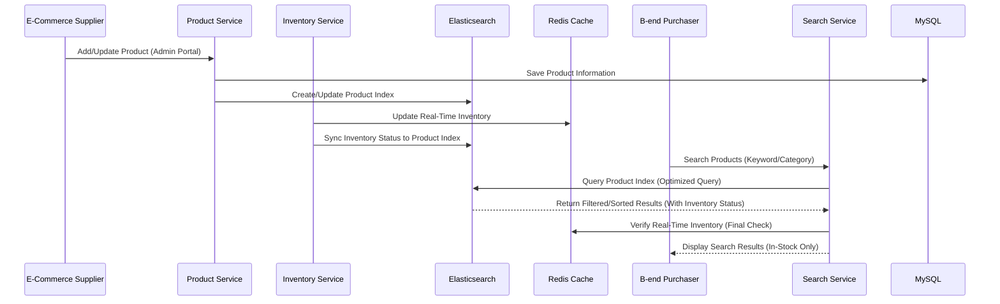

###
<div style="display:flex; align-items:center; gap:12px; margin-bottom:20px;">


<strong>
A Unified Digital Commerce and Logistics Management System
</strong>

<span style="color:gray;">
</span>

</div>
ZTO Jingxuan is a comprehensive e-commerce information system built upon the logistics infrastructure of ZTO Express. The platform integrates business transactions, inventory scheduling, payment processing, and logistics coordination into a unified distributed system serving merchants, consumers, and operational administrators.


# 1 Project Overview

The system was designed to support large-scale commercial operations through modular service architecture and standardized business workflows. By integrating transaction management, inventory coordination, search capability, and real-time communication, the platform enables efficient collaboration across upstream suppliers, downstream consumers, and logistics terminals.

# 2 System Architecture

## 2.1 Architecture Diagram

The e-commerce system was designed with 6 layers, each with clear responsibilities and interfaces, ensuring modularity and scalability to support growing e-commerce traffic and transaction volume. Below is the detailed architecture and design decisions:



### 2.2 Architecture & Engineering Highlights
| Area | Technical Design | Engineering Consideration |
|---|---|---|
| Distributed Service Architecture | Modular business services for users, products, orders, payments, and inventory | Improved scalability, maintainability, and service isolation |
| Asynchronous Event Processing | Kafka-based event queue for order and inventory workflows | Increased throughput and reduced service coupling |
| High-Performance Data Access | Redis caching layer | Reduced database pressure while accepting short-term eventual consistency |
| Search Infrastructure | Elasticsearch-powered product retrieval | Enabled efficient multi-dimensional search with near real-time indexing |
| Hybrid Data Storage | MySQL for transactional data and MongoDB for flexible business data | Balanced strong consistency and schema adaptability |
| Real-Time Communication | WebSocket gateway for operational updates | Enhanced real-time interaction and synchronization |
| Dynamic Configuration Governance | Centralized configuration management | Improved operational flexibility and deployment efficiency |

# 3 My Contribution
I joined the project during the early stage and participated in the maintenance and iterative development of core business modules within a production-grade distributed system.

My responsibilities included:

- Contributing to backend business service development and module integration
- Developing order, inventory, and product-related service workflows
- Participating in distributed service collaboration and API integration
- Assisting in performance optimization through caching and asynchronous processing mechanisms
- Working with real production constraints involving scalability, availability, and operational coordination

# 4 Order & Inventory Workflow
## 4.1 Order Sequence Diagram


## 4.2 Product Search & Inventory Sync Sequence Diagram




# 5 Order & Inventory Code Demonstration

Below are key code snippets developed during the project, demonstrating proficiency in Java/Spring Boot \(e\-commerce backend development\) and Scala/Flink \(e\-commerce data processing\)—critical skills reflected in the project’s delivery\.

## 5.1 Order Service

This code demonstrates the implementation of distributed transactions for e\-commerce orders, including inventory locking, payment processing, and compensation logic—critical for e\-commerce data consistency\.

```java

/**
 * Implementation of Saga Pattern for e-commerce order transactions (core business logic)
 * Key responsibility: Ensure consistency across order, inventory, and payment services
 * E-commerce focus: Handle order creation, payment, inventory deduction, and cancellation
 */
@Service
public class OrderSagaService {

    @Autowired
    private OrderMapper orderMapper;
    @Autowired
    private KafkaTemplate<String, String> kafkaTemplate;
    @Autowired
    private InventoryFeignClient inventoryFeignClient;
    @Autowired
    private PaymentFeignClient paymentFeignClient;

    // Step 1: Create e-commerce order (Saga initiation)
    @Transactional
    public String createOrder(OrderCreateDTO dto) {
        // Design: Generate unique order ID with timestamp to support e-commerce sharding
        String orderId = UUID.randomUUID().toString().replace("-", "") + System.currentTimeMillis();
        Order order = buildOrder(dto, orderId);
        orderMapper.insert(order); // Insert into sharded MySQL order table (e-commerce sharding design)

        // Publish event to Kafka (event-driven e-commerce design)
        OrderCreatedEvent event = new OrderCreatedEvent(orderId, dto.getPurchaserId(), dto.getAmount(), dto.getProductList());
        kafkaTemplate.send("ecommerce-order-events", orderId, JSON.toJSONString(event));

        // Lock inventory immediately to prevent over-sales (e-commerce critical logic)
        boolean lockSuccess = inventoryFeignClient.lockInventory(buildInventoryLockDTO(order));
        if (!lockSuccess) {
            order.setStatus("CANCELLED");
            orderMapper.updateById(order);
            throw new RuntimeException("Inventory shortage, order cancelled");
        }

        return orderId;
    }

    // Step 2: Handle e-commerce payment success (Saga next step)
    @Transactional
    public void handleOrderPaid(OrderPaidEvent event) {
        Order order = orderMapper.selectById(event.getOrderId());
        if (order == null || !"PENDING_PAY".equals(order.getStatus())) {
            throw new RuntimeException("Invalid e-commerce order status");
        }

        // Update order status (e-commerce transaction management)
        order.setStatus("PAID");
        order.setPaymentTime(new Date());
        orderMapper.updateById(order);

        // Call inventory service to deduct stock (e-commerce core logic)
        boolean deductSuccess = inventoryFeignClient.deductInventory(event.getOrderId());
        if (!deductSuccess) {
            // E-commerce compensation logic: Rollback order + refund payment
            order.setStatus("CANCELLED");
            orderMapper.updateById(order);
            paymentFeignClient.refundPayment(event.getOrderId(), event.getPaymentAmount());
            kafkaTemplate.send("ecommerce-order-events", event.getOrderId(), 
                               JSON.toJSONString(new OrderCancelledEvent(event.getOrderId(), "INVENTORY_DEDUCT_FAILED")));
            throw new RuntimeException("Inventory deduction failed, order rolled back and payment refunded");
        }

        // Publish event to trigger order confirmation and notification
        kafkaTemplate.send("ecommerce-order-events", event.getOrderId(), 
                           JSON.toJSONString(new OrderConfirmedEvent(event.getOrderId())));
    }

    // Helper method: Build e-commerce order object (encapsulation for maintainability)
    private Order buildOrder(OrderCreateDTO dto, String orderId) {
        Order order = new Order();
        order.setOrderId(orderId);
        order.setPurchaserId(dto.getPurchaserId());
        order.setProductList(JSON.toJSONString(dto.getProductList()));
        order.setAmount(dto.getAmount());
        order.setStatus("PENDING_PAY");
        order.setCreateTime(new Date());
        order.setSupplierId(dto.getSupplierId());
        return order;
    }

    // Helper method: Build inventory lock DTO for e-commerce scenarios
    private InventoryLockDTO buildInventoryLockDTO(Order order) {
        InventoryLockDTO lockDTO = new InventoryLockDTO();
        lockDTO.setOrderId(order.getOrderId());
        lockDTO.setProductList(JSON.parseArray(order.getProductList(), ProductDTO.class));
        lockDTO.setExpireTime(300); // 5 minutes lock timeout (e-commerce anti-over-sales)
        return lockDTO;
    }
}

```

## 5.2 Inventory Service

This code demonstrates the implementation of real\-time inventory management for e\-commerce, including stock locking, deduction, and cache synchronization—critical for preventing over\-sales and ensuring inventory accuracy\.

```java

/**
 * Implementation of real-time inventory management for e-commerce
 * Key responsibility: Handle inventory locking, deduction, release, and cache synchronization
 * E-commerce focus: Prevent over-sales, ensure real-time inventory accuracy
 */
@Service
public class InventoryService {

    @Autowired
    private InventoryMapper inventoryMapper;
    @Autowired
    private RedisTemplate<String, Object> redisTemplate;
    @Autowired
    private KafkaTemplate<String, String> kafkaTemplate;

    // Redis key prefix for e-commerce inventory
    private static final String REDIS_INVENTORY_KEY = "ecommerce:inventory:";
    // Redis distributed lock key prefix
    private static final String REDIS_LOCK_KEY = "ecommerce:inventory:lock:";

    // Lock inventory for e-commerce order (prevent over-sales)
    @Transactional
    public boolean lockInventory(InventoryLockDTO dto) {
        // E-commerce distributed lock design: Redisson lock to prevent concurrent locking
        RLock lock = redissonClient.getLock(REDIS_LOCK_KEY + dto.getOrderId());
        try {
            // Lock timeout: 5 minutes (consistent with order payment timeout)
            boolean locked = lock.tryLock(5, 300, TimeUnit.SECONDS);
            if (!locked) {
                return false;
            }

            // Check real-time inventory from Redis first (e-commerce performance optimization)
            for (ProductDTO product : dto.getProductList()) {
                String redisKey = REDIS_INVENTORY_KEY + product.getProductId();
                Integer stock = (Integer) redisTemplate.opsForValue().get(redisKey);
                if (stock == null || stock < product.getQuantity()) {
                    return false; // Insufficient inventory
                }
            }

            // Deduct locked inventory in Redis (real-time sync)
            for (ProductDTO product : dto.getProductList()) {
                String redisKey = REDIS_INVENTORY_KEY + product.getProductId();
                redisTemplate.opsForValue().decrement(redisKey, product.getQuantity());
                // Record locked inventory for later deduction or release
                redisTemplate.opsForHash().put(REDIS_LOCK_KEY + "record", dto.getOrderId() + ":" + product.getProductId(), product.getQuantity());
            }

            return true;
        } catch (Exception e) {
            log.error("Inventory lock failed for order: {}", dto.getOrderId(), e);
            return false;
        } finally {
            if (lock.isHeldByCurrentThread()) {
                lock.unlock();
            }
        }
    }

    // Deduct inventory after e-commerce order payment
    @Transactional
    public boolean deductInventory(String orderId) {
        // Get locked inventory record
        Map<Object, Object> lockedRecords = redisTemplate.opsForHash().entries(REDIS_LOCK_KEY + "record");
        List<InventoryUpdateDTO> updateList = new ArrayList<>();

        // Update database inventory and release lock record
        for (Map.Entry<Object, Object> entry : lockedRecords.entrySet()) {
            String key = (String) entry.getKey();
            if (key.startsWith(orderId + ":")) {
                String productId = key.split(":")[1];
                Integer quantity = (Integer) entry.getValue();

                // Update MySQL inventory (e-commerce data consistency)
                InventoryUpdateDTO updateDTO = new InventoryUpdateDTO();
                updateDTO.setProductId(productId);
                updateDTO.setDeductQuantity(quantity);
                updateList.add(updateDTO);

                // Remove lock record from Redis
                redisTemplate.opsForHash().delete(REDIS_LOCK_KEY + "record", key);
            }
        }

        if (updateList.isEmpty()) {
            return false;
        }

        // Batch update inventory in MySQL (e-commerce efficiency optimization)
        inventoryMapper.batchDeductInventory(updateList);

        // Publish inventory update event for e-commerce search sync
        kafkaTemplate.send("ecommerce-inventory-events", JSON.toJSONString(new InventoryUpdatedEvent(updateList)));
        return true;
    }

    // Release locked inventory for cancelled e-commerce orders
    @Transactional
    public void releaseInventory(String orderId) {
        Map<Object, Object> lockedRecords = redisTemplate.opsForHash().entries(REDIS_LOCK_KEY + "record");

        for (Map.Entry<Object, Object> entry : lockedRecords.entrySet()) {
            String key = (String) entry.getKey();
            if (key.startsWith(orderId + ":")) {
                String productId = key.split(":")[1];
                Integer quantity = (Integer) entry.getValue();

                // Restore inventory in Redis (real-time sync)
                String redisKey = REDIS_INVENTORY_KEY + productId;
                redisTemplate.opsForValue().increment(redisKey, quantity);

                // Remove lock record from Redis
                redisTemplate.opsForHash().delete(REDIS_LOCK_KEY + "record", key);
            }
        }

        // Publish inventory release event for e-commerce search sync
        kafkaTemplate.send("ecommerce-inventory-events", JSON.toJSONString(new InventoryReleasedEvent(orderId)));
    }
}

```

# 6 Technical Reflection

This project helped me understand how a real e-commerce system operates as an integrated business infrastructure rather than isolated services. I gained practical insight into how transaction processing, inventory coordination, and logistics workflows must be aligned to support end-to-end business operations.

I observed the tradeoff between system consistency and performance in production environments, where asynchronous processing, caching, and event-driven design were used to improve scalability while accepting eventual consistency in certain workflows.

The experience also highlighted the importance of balancing technical design with business requirements, especially in areas such as order fulfillment efficiency, inventory accuracy, and system responsiveness.

Overall, it strengthened my understanding of how information systems support real-world operational decision-making across multiple business entities.

